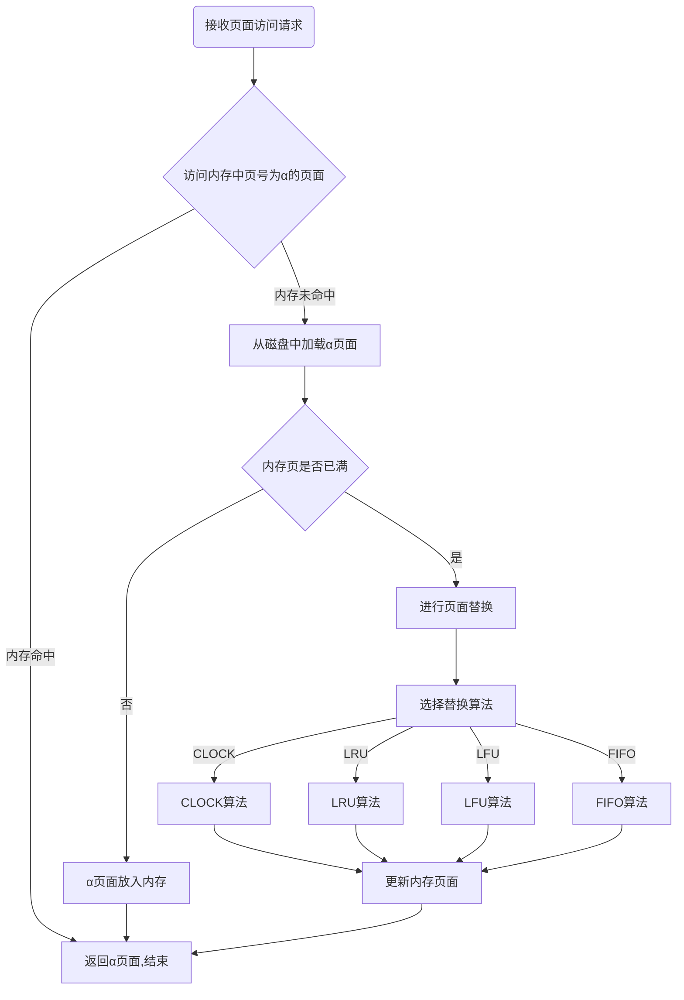

# 内存页面置换算法 JAVA实现 附源码

## 概述

内存页面置换算法是操作系统中用于管理虚拟内存的重要组成部分，它负责在内存不足时选择合适的页面进行替换，以便为新的页面腾出空间。以下是几种常见的内存页面置换算法：

1. **最佳（Optimal）置换算法：** 这是一种理想化的算法，它在选择要被置换的页面时选择未来最长时间内不会被访问的页面。尽管这个算法可以达到最佳的性能，但是由于需要预测未来页面访问情况，实际中很难实现。
2. **先进先出（FIFO）置换算法：** 这是一种简单的置换算法，它选择最早进入内存的页面进行替换。虽然实现简单，但是它存在"Belady异常"，即增加内存大小时可能会导致缺页次数反而增加的情况。
3. **最近最少使用（LRU）置换算法：** 这个算法选择最近最长时间未被访问的页面进行替换。LRU算法通过维护一个页面访问历史记录或者使用特定的数据结构（如链表或者有序数组）来实现。LRU算法在实践中性能较好，但是实现起来可能会比较复杂。
4. **最近最不经常使用（LFU）置换算法：** 这个算法选择最近访问次数最少的页面进行替换。LFU算法适用于一些特定的工作负载，但是可能受到访问次数和时间窗口的影响。
5. **时钟（Clock）置换算法：** 这是一种简化的近似LRU算法，它维护一个环形缓冲区，并使用一个指针按顺序查看页面的访问情况。当需要替换页面时，指针停在最近未被访问的页面上，然后替换它。这个算法相对较简单且性能较好。

> 实验说明：真实的内存页面访问应该符合局部性原理，本次实验的页面访问队列为随机生成，所以部分算法命中率可能会和预期不符
> 

### 页面置换流程



## 算法实现

主要有`VirtualMemoryManagement`、`PageFrame`两个类，`VirtualMemoryManagement` 用来管理内存块，里面有各种页面置换算法，`PageFrame`中保存着内存块的各种信息。

```java
public class PageFrame {
    private int pageNumber = -1; //页面号
    
    private int accessTime = 0; //访问次数 （LFU）使用
    
    private int recentAccess = 0; //距离最近访问次数（LRU使用）
    
    private int futureAccess = 0; //未来访问状态（OPT使用）
    
    private int accessStatus = 0; //访问状态  (clock使用)
    
    public void addAccessTime() //增加访问次数

}
```

```java
public class VirtualMemoryManagement {

    public static int memoryPageSize = 3; // 内存页大小
    
    public static int accessNum = 100; // 访问序列数量
    
    public static int pageNumber = 10; // 内存页号

    public static int time = 0; // 计算机时钟
    
    public static int clockPointer = 0; // clock缓存区指针

    public static int missingPageNum = 0; // 缺页次数
    
    public static int permutationNum = 0; // 置换次数
    
    public  List<PageFrame> pageFrameList = new ArrayList<>(memoryPageSize);  //模拟内存页
    
    public  List<Integer> accessList ;

   
    // 初始化访问序列
    public static List<Integer> initAccessList()

    // 获取访问序列
    public static List<Integer> getAccessList(List<Integer> accessList)

    public void printMemory()
    
    // 检查内存中是否包含指定的页面
    public boolean memContains(Integer accessNumber)

    public void run(String type)

    // 更新访问页面的最近访问时间
    private void addAccessRecentTime() 

    // 根据置换算法选择要替换的内存页
    private void replacePageFrame(Integer accessNumber,String type)
    
    // CLOCK置换算法
    private void CLOCK(PageFrame pageFrame)

    // OPT置换算法
    private void OPT(PageFrame pageFrame)

    // LRU置换算法
    private void LRU(PageFrame pageFrame)

    // LFU置换算法
    private void LFU(PageFrame pageFrame)

    // FIFO置换算法
    private void FIFO(PageFrame pageFrame)

    // 将页面添加到内存中
    private void addPageFrame(Integer accessNumber)
    
    public static void printResult()
    
    public static void resetResult()

}
```

### FIFO

先进先出，这个算法实现起来非常简单就像我们排队一样，值得一提的是FIFO方法会产生`belady`异常，这个`belady`异常说的就是正常情况下增加内存页数量应该会增加内存的命中率，但是当使用FIFO算法时，把内存页面数从3加到4，不能保证增加内存命中率。

```java
private void FIFO(PageFrame pageFrame) {
    pageFrameList.remove(0);
    pageFrameList.add(pageFrame);
}
```


### LRU LFU

这个算法非常像，LFU是替换最近用的次数最少的页面，LRU是替换最久不用的页面。

这两个算法基于局部性原理，最近经常使用的页面，下次使用的可能性更大；使用越多的页面，下次使用的可能性更大；

```java
//Least Recently Used
private void LRU(PageFrame pageFrame) {
    PageFrame recentPageFrame= pageFrameList.get(0);
    for (int i = 1; i < pageFrameList.size(); i++) {
        PageFrame oldPageFrame = pageFrameList.get(i);
        //找到最久不用的页面
        if (recentPageFrame.getRecentAccess()<oldPageFrame.getRecentAccess()){
            recentPageFrame = oldPageFrame;
        }
    }
    pageFrameList.remove(recentPageFrame);
    pageFrameList.add(pageFrame);

}

//Least Frequently Used
private void LFU(PageFrame pageFrame) {
    PageFrame leastPageFrame= pageFrameList.get(0);
    for (int i = 1; i < pageFrameList.size(); i++) {
        PageFrame oldPageFrame = pageFrameList.get(i);
        //找到最近用的次数最少的页面
        if (leastPageFrame.getAccessTime()>oldPageFrame.getAccessTime()){
            leastPageFrame = oldPageFrame;
        }
    }
    pageFrameList.remove(leastPageFrame);
    pageFrameList.add(pageFrame);
}
```


### OPT

OPT（Optimal）页面置换算法是一种理论上的最佳页面置换算法，也称为最佳置换算法。它是一种基于未来访问页面的策略，即根据未来最长时间内不会被访问的页面进行置换。

在OPT页面置换算法中，系统会预测未来每个页面的访问情况，并选择未来最长时间内不会被访问的页面进行置换。这种算法的优点是可以最大程度地减少页面置换的次数，从而提高系统的性能。

实际上很难准确预测未来页面的访问情况，因此OPT算法通常只用作理论研究，而在实际应用中很少被使用。

这里我遍历访问队列，如果找到和内存中一样的页面，就表示在未来我需要访问这个页面，就设置pageFrame的未来访问位=1，找到（内存数-1）个未来访问页面时，此时在内存中未来访问位为0的页面就是我要替换的，因为它是未来最长时间内不会被访问的

```java
//Optimal Page Replacement
private void OPT(PageFrame pageFrame) {
    int memorySize = pageFrameList.size();
    for (Integer integer : accessList) {
        for (PageFrame frame : pageFrameList) {
            if (frame.getPageNumber() == integer){
                frame.setFutureAccess(1);
                memorySize--;
                if (memorySize==1){
                    for (PageFrame frame2 : pageFrameList) {
                        if (frame2.getFutureAccess()==0){
                            pageFrameList.remove(frame2);
                            pageFrameList.add(pageFrame);
                            return;
                        }
                    }
                }
            }

        }
    }
}
```


### CLOCK

CLOCK（Clock Replacement）页面置换算法是一种基于近似LRU（Least Recently Used）算法的页面置换算法。它使用一个类似时钟的数据结构来维护页面的访问情况，并根据页面的访问位和修改位来进行页面置换的决策。

CLOCK算法维护一个环形缓冲区，其中每个页面都有一个访问位（用于表示页面是否被访问过）和一个修改位（用于表示页面是否被修改过）。当需要置换页面时，算法会在环形缓冲区中顺时针地查找页面，如果找到一个未被访问过的页面（访问位为0），则选择该页面进行置换。如果所有页面的访问位都为1，则会继续顺时针地查找，直到找到一个未被访问过的页面。

```java
private void CLOCK(PageFrame pageFrame) {
    while (true){
        PageFrame replacePageFrame = pageFrameList.get(clockPointer);
        if (replacePageFrame.getAccessStatus() == 1){
            replacePageFrame.setAccessStatus(0);
        }else {
            pageFrameList.remove(replacePageFrame);
            pageFrameList.add(pageFrame);
            break;
        }
        clockPointer = ++clockPointer%pageFrameList.size();
    }
}
```


### 源码

**`PageFrame.class`** 

```java
public class PageFrame {
    private int pageNumber = -1; //页面号
    private int accessTime = 0; //访问次数 （LFU）使用
    private int recentAccess = 0; //距离最近访问次数（LRU使用）
    private int futureAccess = 0; //距离最近访问次数（LRU使用）

    public int getFutureAccess() {
        return futureAccess;
    }

    public void setFutureAccess(int futureAccess) {
        this.futureAccess = futureAccess;
    }

    private int accessStatus = 0; //访问状态

    public int getAccessStatus() {
        return accessStatus;
    }

    public void setAccessStatus(int accessStatus) {
        this.accessStatus = accessStatus;
    }

    public int getPageNumber() {
        return pageNumber;
    }

    public void setPageNumber(int pageNumber) {
        this.pageNumber = pageNumber;
    }

    public int getAccessTime() {
        return accessTime;
    }

    public void setAccessTime(int accessTime) {
        this.accessTime = accessTime;
    }

    public void addAccessTime() {
        this.accessTime++;
    }
    public void addRecentAccessTime() {
        this.recentAccess++;
    }

    public int getRecentAccess() {
        return recentAccess;
    }

    public void setRecentAccess(int recentAccess) {
        this.recentAccess = recentAccess;
    }
}
```

`**VirtualMemoryManagement.class`** 

```java
public class VirtualMemoryManagement {
    public static int memoryPageSize = 3; // 内存页大小
    
    public static int accessNum = 10; // 访问序列数量
    
    public static int pageNumber = 10; // 内存页号

    public static int time = 0; // 计算机时钟
    
    public static int clockPointer = 0; // clock缓存区指针

    public static int missingPageNum = 0; // 缺页次数
    
    public static int permutationNum = 0; // 置换次数
    
    public  List<PageFrame> pageFrameList = new ArrayList<>(memoryPageSize);  //模拟内存页
    
    public  List<Integer> accessList ;

    public List<PageFrame> getPageFrameList() {
        return pageFrameList;
    }

    public void setPageFrameList(List<PageFrame> pageFrameList) {
        this.pageFrameList = pageFrameList;
    }

    public List<Integer> getAccessList() {
        return accessList;
    }

    public void setAccessList(List<Integer> accessList) {
        this.accessList = accessList;
    }

    public  static  List<Integer> initAccessList(){
        List<Integer> accessList =new ArrayList<>(accessNum);
        System.out.print("访问内存页序列：");
        for (int i = 0; i < accessNum; i++) {
            int value = (int)(Math.random() * pageNumber)+1;
            accessList.add(value);
            System.out.print("   "+value);
        }
        System.out.println();
        return accessList;
    }
    public  static  List<Integer> beladyList(){
        Integer[] belady = {1,2,3,4,1,2,5,1,2,6,7,5};

        return Arrays.asList(belady);
    }
    public  static  List<Integer> getAccessList(List<Integer> accessList){
        //克隆一个accessList
        accessList = new ArrayList<>(accessList);
        return accessList;
    }

    public void printMemory(){
        System.out.println("--------------------内存-------------------");
        if (pageFrameList.isEmpty()){
            System.out.print("内存当前为空");
        }
        for (PageFrame pageFrame : pageFrameList) {
//            System.out.print("No "+pageFrame.getPageNumber() +" - "+"access："+pageFrame.getAccessTime()+" - "+"recent ："+pageFrame.getRecentAccess()+" - clockStatus:"+pageFrame.getAccessStatus());
            System.out.print("No "+pageFrame.getPageNumber());
            System.out.print(" | ");
        }
        System.out.println();
    }

    public boolean memContains(Integer accessNumber){
        for (PageFrame pageFrame : pageFrameList) {
            if (pageFrame.getPageNumber() == (accessNumber)){
                pageFrame.addAccessTime();
                pageFrame.setAccessStatus(1);
                pageFrame.setRecentAccess(0);
                return true;
            }
        }
        return false;
    }

    public void run(String type) {
        System.out.println("--------------------"+type+"算法-------------------");
        while (!accessList.isEmpty()){
            printMemory();
            Integer accessNumber = accessList.get(0);
            // 从内存中访问accessNumber
            if (memContains(accessNumber)){

            }else {
                // 访问内存页未命中，
                // 1.内存有空间,直接放入内存
                if(pageFrameList.size()<memoryPageSize){
                    addPageFrame(accessNumber);
                }else if(pageFrameList.size()==memoryPageSize){
                    // 2.内存没空间选择置换算法，换掉内存页
                   replacePageFrame(accessNumber,type);
                }
            }
            accessList.remove(0);
            addAccessRecentTime();
            time++;
        }
        printMemory();
        printResult();
        resetResult();
    }

    private void addAccessRecentTime() {
        for (PageFrame pageFrame : pageFrameList) {
            pageFrame.addRecentAccessTime();
        }
    }

    private void replacePageFrame(Integer accessNumber,String type) {
        permutationNum++;
        PageFrame pageFrame = new PageFrame();
        pageFrame.setPageNumber(accessNumber);
        switch (type){
            case "FIFO":
                FIFO(pageFrame);
                break;
            case "LRU":
                LRU(pageFrame);
                break;
            case "LFU":
                LFU(pageFrame);
                break;
            case "OPT":
                OPT(pageFrame);
                break;
            case "CLOCK":
                CLOCK(pageFrame);
                break;
        }
    }

    private void CLOCK(PageFrame pageFrame) {
        while (true){
            PageFrame replacePageFrame = pageFrameList.get(clockPointer);
            if (replacePageFrame.getAccessStatus() == 1){
                replacePageFrame.setAccessStatus(0);
            }else {
                pageFrameList.remove(replacePageFrame);
                pageFrameList.add(pageFrame);
                break;
            }
            clockPointer = ++clockPointer%pageFrameList.size();
        }
    }

private void OPT(PageFrame pageFrame) {
    //遍历访问队列，如果找到和内存中一样的页面，设置未来访问访问位=1，找到 内存数-1个未来访问页面，此时替换未来访问位=0的内存页面
    int memorySize = pageFrameList.size();
    for (Integer integer : accessList) {
        for (PageFrame frame : pageFrameList) {
            if (frame.getPageNumber() == integer){
                frame.setFutureAccess(1);
                memorySize--;
                if (memorySize==1){
                    for (PageFrame frame2 : pageFrameList) {
                        if (frame2.getFutureAccess()==0){
                            pageFrameList.remove(frame2);
                            pageFrameList.add(pageFrame);
                            return;
                        }
                    }
                }
            }

        }
    }
}

    private void LRU(PageFrame pageFrame) {
        PageFrame recentPageFrame= pageFrameList.get(0);
        for (int i = 1; i < pageFrameList.size(); i++) {
            PageFrame oldPageFrame = pageFrameList.get(i);
            if (recentPageFrame.getRecentAccess()<oldPageFrame.getRecentAccess()){
                recentPageFrame = oldPageFrame;
            }
        }
        pageFrameList.remove(recentPageFrame);
        pageFrameList.add(pageFrame);

    }

    private void LFU(PageFrame pageFrame) {
        PageFrame leastPageFrame= pageFrameList.get(0);
        for (int i = 1; i < pageFrameList.size(); i++) {
            PageFrame oldPageFrame = pageFrameList.get(i);
            if (leastPageFrame.getAccessTime()>oldPageFrame.getAccessTime()){
                leastPageFrame = oldPageFrame;
            }
        }
        pageFrameList.remove(leastPageFrame);
        pageFrameList.add(pageFrame);
    }

    private void FIFO(PageFrame pageFrame) {
        pageFrameList.remove(0);
        pageFrameList.add(pageFrame);
    }

    private void addPageFrame(Integer accessNumber) {
        missingPageNum++;
        PageFrame pageFrame = new PageFrame();
        pageFrame.setPageNumber(accessNumber);
        pageFrameList.add(pageFrame);
    }
    public static void printResult(){
        System.out.println();
        System.out.println("缺页次数： "+missingPageNum);
        System.out.println("置换次数： "+permutationNum);
        System.out.println("缺页率： "+(double)missingPageNum/(double) accessNum);
        System.out.println("命中率： "+ (1 - (((double)missingPageNum + (double) permutationNum)/(double) accessNum)));
    }
    public static void resetResult(){
        missingPageNum = 0;
        permutationNum = 0;
    }

    public static void main(String[] args) {
        VirtualMemoryManagement FIFO = new VirtualMemoryManagement();
        VirtualMemoryManagement FIFO2 = new VirtualMemoryManagement();
        VirtualMemoryManagement LRU = new VirtualMemoryManagement();
        VirtualMemoryManagement LFU = new VirtualMemoryManagement();
        VirtualMemoryManagement CLOCK = new VirtualMemoryManagement();
        List<Integer> integers = initAccessList();
        List<Integer> beladyList = beladyList();
        FIFO.setAccessList(getAccessList(integers));
        FIFO2.setAccessList(getAccessList(beladyList));
        LRU.setAccessList(getAccessList(integers));
        LFU.setAccessList(getAccessList(integers));
        CLOCK.setAccessList(getAccessList(integers));

//        FIFO.run("FIFO");
//        VirtualMemoryManagement.memoryPageSize = 4;
//        FIFO2.run("FIFO");
//        LRU.run("LFU");
//        LFU.run("LRU");
//        LFU.run("OPT");
        CLOCK.run("CLOCK");

    }
}
```